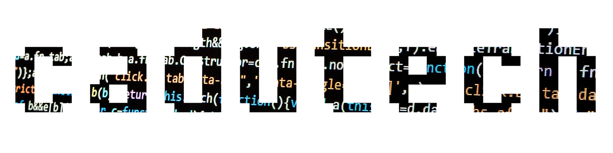
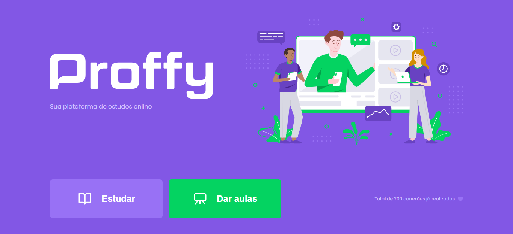

<h1 align="center" style="font-weight: bold">NLW-2nd-Week</h1>

Project made from the Rocketseat Next Level Week 2 (dev marathon) by: 

<h1 align="center">
    
</h1>

 &nbsp;&nbsp;&nbsp;&nbsp;

  

  <a href="#used-technologies">Used Technologies</a>&nbsp;&nbsp;&nbsp;|&nbsp;&nbsp;&nbsp;
  <a href="#the-project">The Project</a>&nbsp;&nbsp;&nbsp;|&nbsp;&nbsp;&nbsp;
  <a href="#the-layout">The Layout</a>&nbsp;&nbsp;&nbsp;|&nbsp;&nbsp;&nbsp;
  <a href="#license">License</a>

## Used Technologies

This project was developed using the technologies below:

- [Node.js](https://nodejs.org/en/)
- [Express](https://expressjs.com/pt-br/)
- [SQLite](https://www.sqlite.org/index.html)
- [Nunjucks](https://mozilla.github.io/nunjucks/)

## The Project

Proffy is a online study platform where users can find instructors online acording to their avaiability.

## The Layout

### Web Version

 

### Mobile Version

   

You can view the complete project layout and requirements on [Figma](https://www.figma.com) using the links below:

- [Web version](https://www.figma.com/file/MF64jar2fVwglpaLCpoig4/Proffy_Mobile)
- [Mobile version](https://www.figma.com/file/MF64jar2fVwglpaLCpoig4/Proffy_Mobile)

## License

This project is under the MIT license. See the file [LICENSE](LICENSE.md) for additional details.

---
